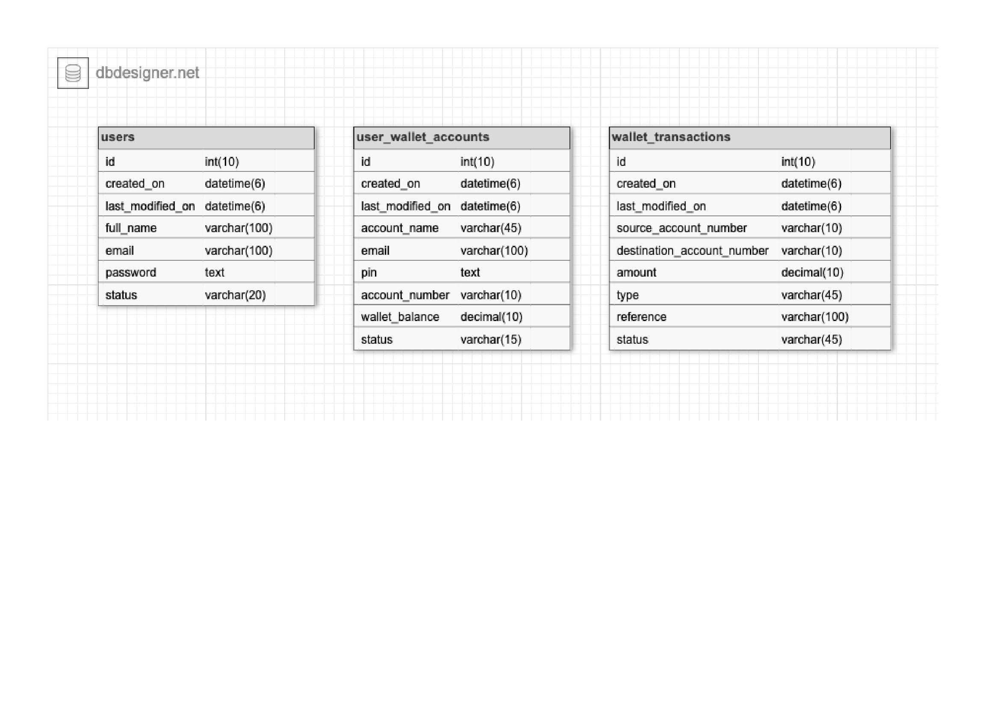

demo-credit-wallet-service-api
A node js api for a wallet service, accounts for user, transfer funds and withdraw fund.

Steps

Note:
The api service allows user to /create-account, /login with the created account details, which will return a token which will be use to access the other protected endpoint for the user to make a to another account (/transfer), withdraw from hist wallet (/withdraw) and /fund-account.

-postman collection link (https://documenter.getpostman.com/view/8615053/VUqptHwE);

Download & Build on local

1) Clone the repository, install node packages and verify routes locally
//on local
git clone https://github.com/shewen41/demo-credit-wallet-service.git

cd demo-credit-wallet-service

npm install

a migration with sql to create the neccessary schema and tables is available.

run the migration

(create a .env file with the following enviroment variable keys needed to run the app)

#express server config

PORT=4000
HOST=localhost
HOST_URL=http://localhost:4000

#mysql database config

MYSQL_USER=root
MYSQL_PASSWORD=123456
MYSQL_DATABASE=demo_creditdb
MYSQL_HOST=localhost
MYSQL_DB_PORT=3307

(replace the value with your local details)

#jwt secret key
TOKEN_KEY = SECRET

run npm start

Open your local browser and verify the sample-node-api is working by accessing:
http://localhost:{port specified in .env}/api/create-accounts
http://localhost:{port specified in .env}/api/fund-account
http://localhost:{port specified in .env}/api/login
http://localhost:{port specified in .env}/api/transfer
http://localhost:{port specified in .env}/api/withdraw

